## Day 1 Homework
### IP screenshot

## Day 1 Homelab

### D1 configuration
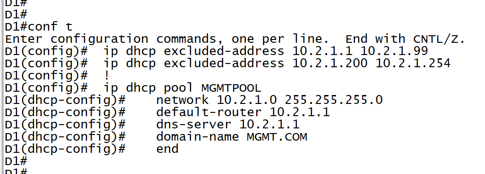
### D2 configuration
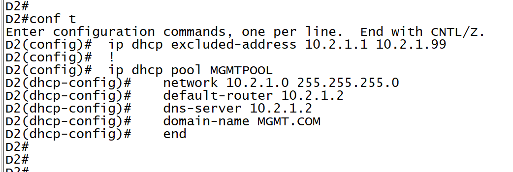
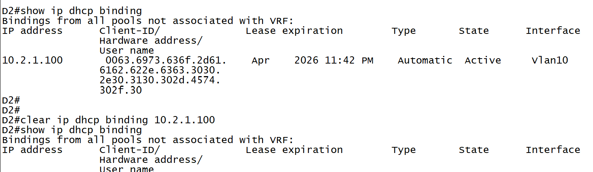
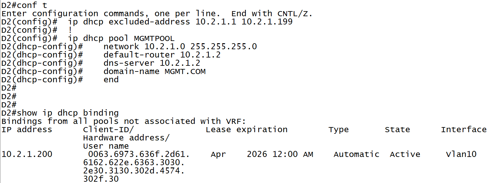

### A1 configuration 
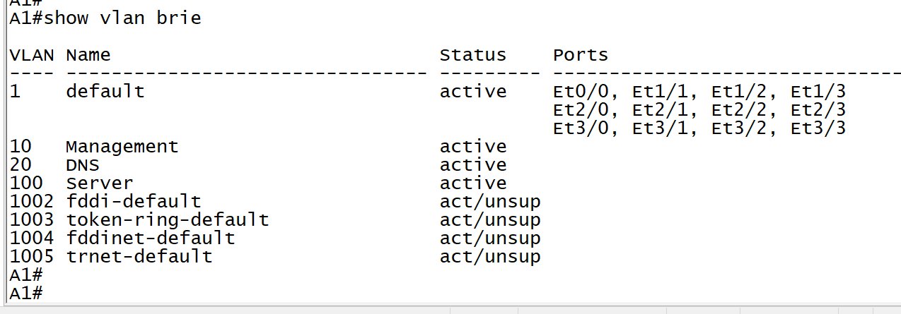
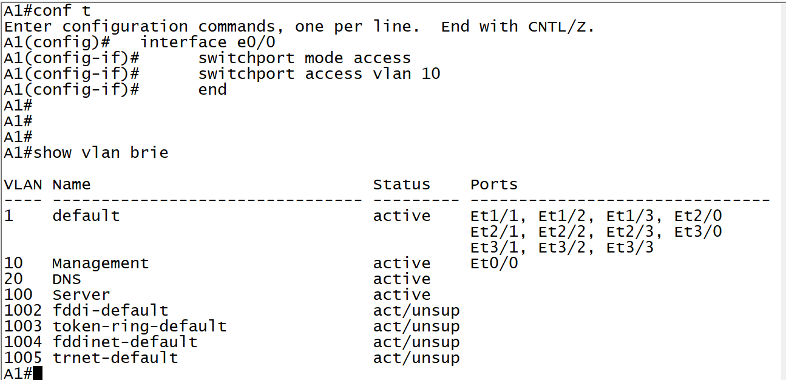
### A2 configuration
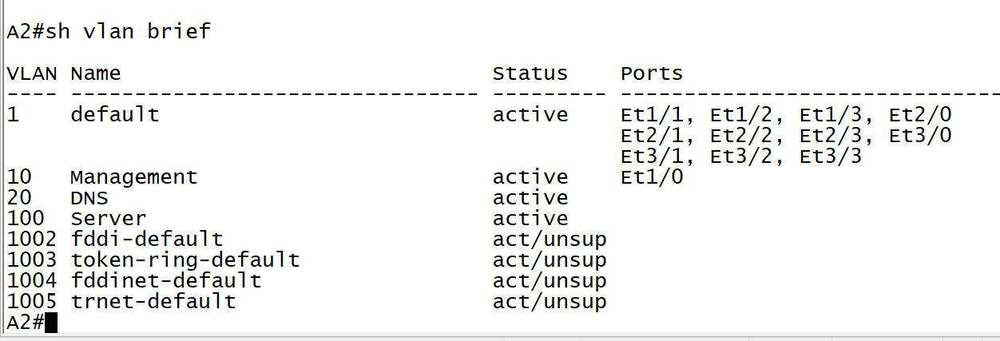

### P1 configuration
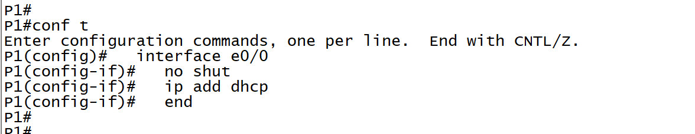
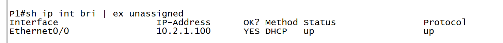
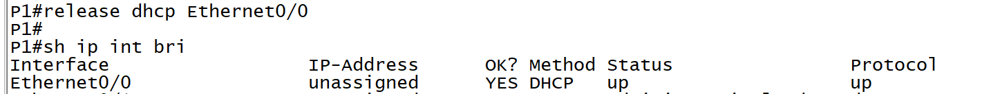
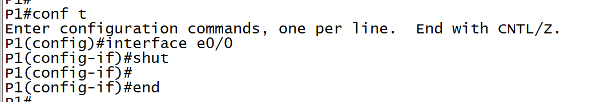
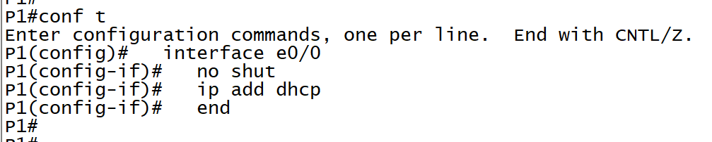
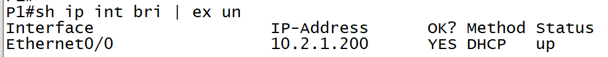

### P2 configuration
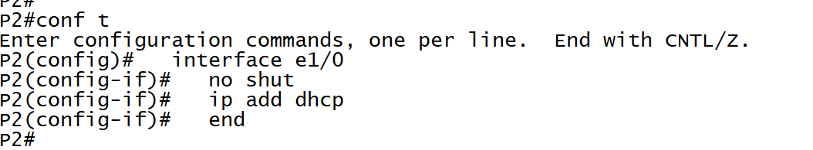
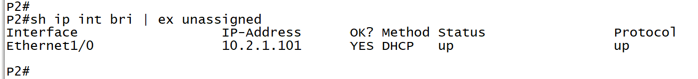

<!-- ### Day 1 Exercise 02 -->