## Day 2 Homework

### Diagram
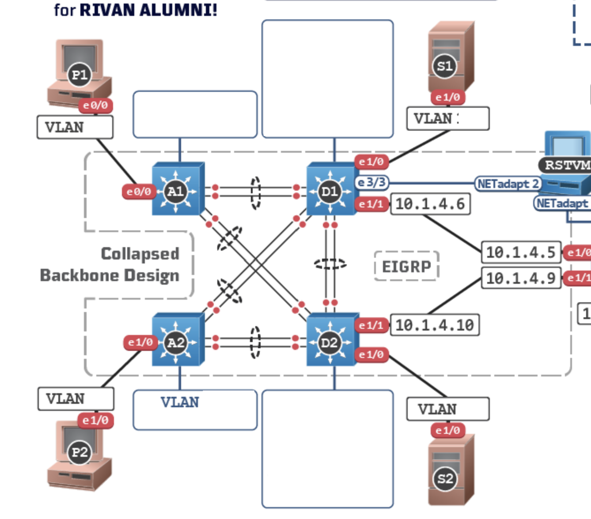


### P1 Exercise

BDO VPN
- 25 WFH
- 172.16.0.0/16
- VLAN 2 BDO
- D1, A1, P1

25 = 5b \
/32 - 5 = /27 | 4Octet,32i   255.255.255.224    \
subnet: 172.16.0.32/27 \
1st: 172.16.0.33 \
last: 172.16.0.62 \
broadcast: 172.16.0.63 \
notYOURS: 172.16.0.64/27 


#### P1 commands
25 * .10 = 2.5 = 3 
```
!@D1:
config t
   vlan 2
      name BDO VPN
      exit
   interface vlan 2
      no shut
      ip add 172.16.0.33 255.255.255.224
      exit
   ip dhcp excluded-add 172.16.0.33 172.16.0.35
   ip dhcp pool "BDO VPN"
      NETWORK 172.16.0.32 255.255.255.224
      DEFAULT-ROUTER 172.16.0.33
      end
```


```
!@A1:
conf t
   int e0/0
   no shut 
   switchport access vlan 2
   do sh vlan bri
```

```
!@P1:
conf t
   int e0/0
   no shut
   ip add DHCP
   DO BP  
```

#### P1 Screenshots
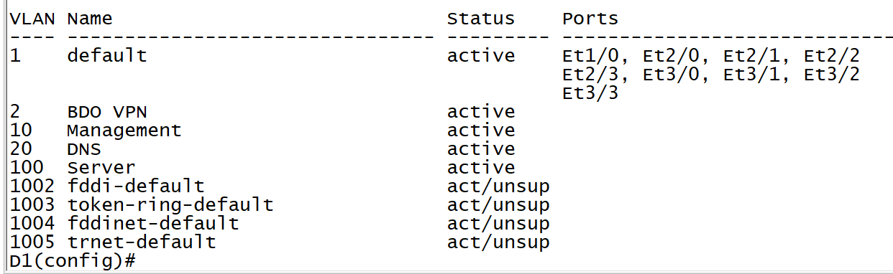
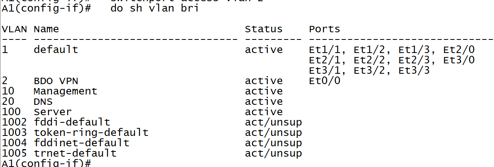
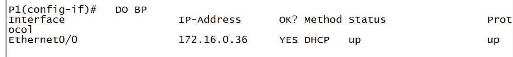

### P2 Exercise

BPI.com.ph
- 5000 employees
- 10.0.0.0/8
- VLAN 3 BPI
- D2, A2, P2


5000 = 13b \
/32 - 13 = /19 | 3Octet,32i   255.255.224.0    \
subnet: 10.0.32.0/19 \
1st: 10.0.32.1 \
last: 10.0.63.254 \
broadcast: 10.0.63.255 \
notYOURS: 10.0.64.0/19

#### P2 Commands
```
!@D1:
config t
   vlan 3
      name BPIVLAN
      exit
   int vlan 3
      no shut
      ip add 10.0.32.1 255.255.224.0
      exit
   ip dhcp excluded-add 10.0.32.1 10.0.32.100
   ip dhcp pool BPIVLAN
      NETWORK 10.0.32.0 255.255.224.0
      DEFAULT-ROUTER 10.0.32.1
      end
```

```
!@A2:
conf t
   int e1/0
      no shut 
      switchport access vlan 3
      do sh vlan bri
```

```
!@P2:
conf t
   int e1/0
      no shut
      ip add DHCP
      DO BP
```

#### P2 Screenshots
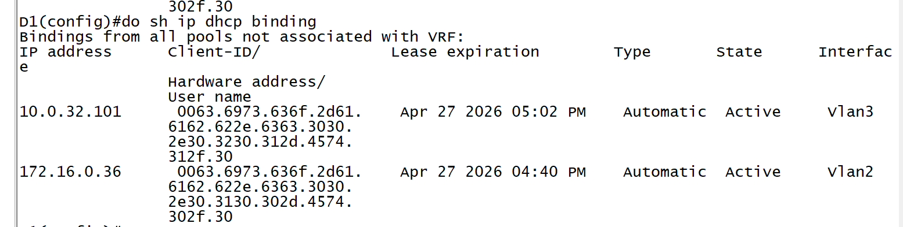
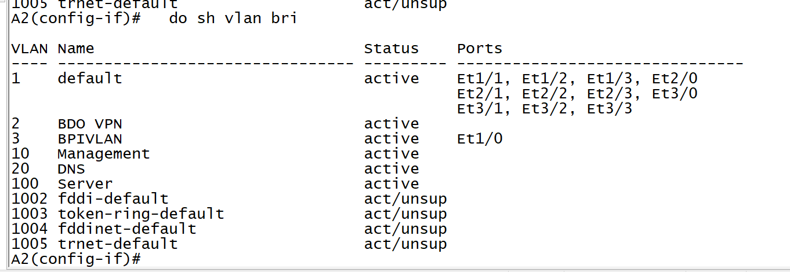
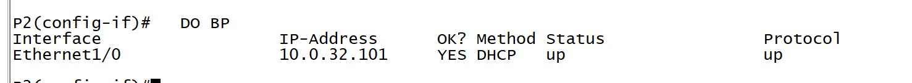


### S2 Exercise
PSBANK-VPN
- 6 WFH VPN
- 172.16.0.0/16
- VLAN 4
- D1, D2, S2


6 = 3b \
/32 - 3 = /29 | 4Octet,8i   255.255.255.248    \
subnet: 172.16.0.8/29 \
1st: 172.16.0.9 \
last: 172.16.0.15 \
notYOURS: 172.16.0.16/29


#### S2 Commands
```
!@D1:
config t
   vlan 4
      name PSBANK-VPN
      exit
   int vlan 4
      no shut
      ip add 172.16.0.9 255.255.255.248
      exit
   ip dhcp excluded-add 172.16.0.9
   ip dhcp pool PSBANK-VPN
      NETWORK 172.16.0.8 255.255.255.248
      DEFAULT-ROUTER 172.16.0.9
      end
```

```
!@D2:
conf t
   int e1/0
      no shut
      switchport access vlan 4
      do sh vlan bri
```

```
!@S2:
conf t
   int e1/0
      no shut
      ip add DHCP
      DO BP
```
#### S2 Screenshots
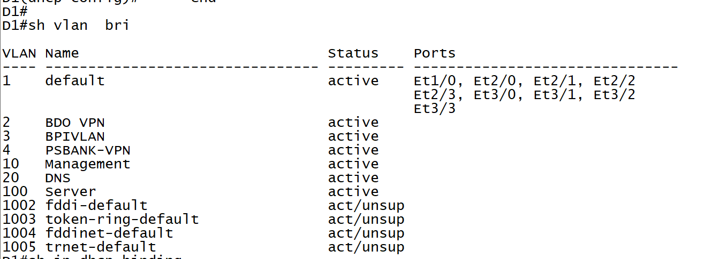
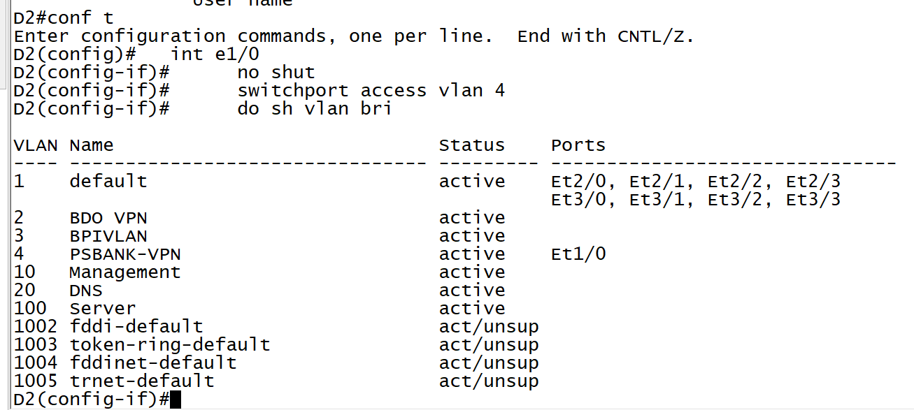
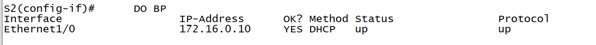
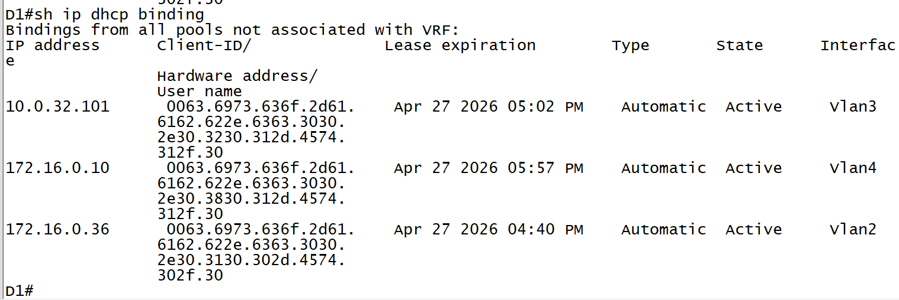